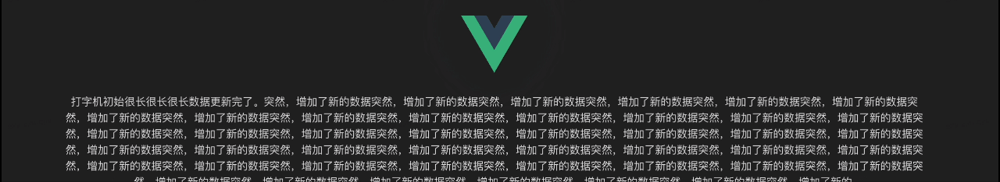

# vue3-typewriter

Vue3 Component for typewriter effects.

[](https://www.npmjs.com/package/@asasugar-use/vue3-typewriter)
[](https://www.npmjs.com/package/@asasugar-use/vue3-typewriter)

## Effects



## Installation

- npm/yarn/pnpm

```shell
npm install @asasugar-use/vue3-typewriter
yarn add @asasugar-use/vue3-typewriter
pnpm add @asasugar-use/vue3-typewriter
```

## Use

- Import component

```js
import VueTypewriter from  "@asasugar-use/vue3-typewriter";
```

- Template

```vue
 <VueTypewriter text="打字机当前文本。" />
```

## Props

| Name | Type | Description | Required | Default |
| ------ | ------ | ------ | ------ | ------ |
| text | String | Text with typewriter effect | Yes | 打字机文本。 |
| typingSpeed | Number | Typing speed, the larger the value, the slower the speed | No | 100 |
| cursorShow | Boolean | Is the cursor at the end of the text flashing | No | true |
| cursorColor | String | Cursor color value | No | red |

## Methods

| Name | Type | Description |
| ------ | ------ | ------ |
| completed | Function | Callback for typing completion |
